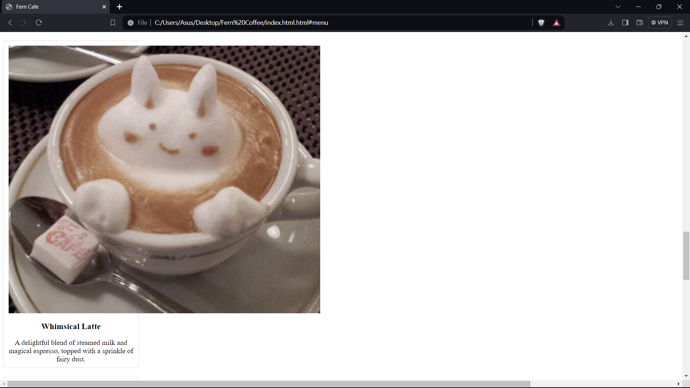
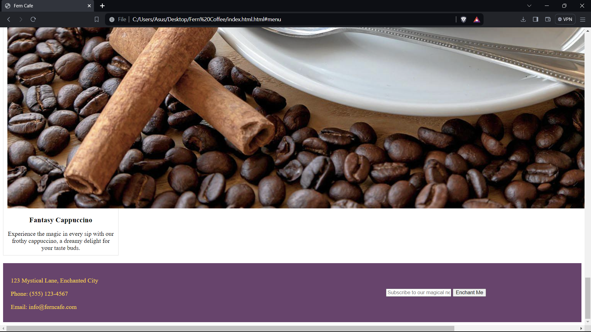

# **Fern Cafe**

Welcome to the enchanting world of CozyCup Café, where each cup is a journey into fantasy.

## **Project Description**

Fern Cafe is a project that seeks to foster creativity and mental exploration within a tranquil setting infused with elements of fantasy.  Our goal is to create an immersive experience that transcends traditional café encounters, inviting customers to step into a fantasy realm where culture and the art converge.

### **Features**

- **Home** 

- **Menu** 

- **About Us**

- **Contact Us**

#### **Screen Captures**

Welcome to Fern Cafe: Where Enchanting Brews Meet Magical Moments. Home greetings!

Sample Products that attract clients

Catching users attention with display of description that is group together.

Footer that state the sample contact details .

##### **About the Authors**

*Name:* [Michael Angelo Demadura]

*Email:* [202080036@psu.palawan.edu.ph ]

*Name:* [Jeffer Molato]

*Email:* [2020120085@psu.palawan.edu.ph ]

